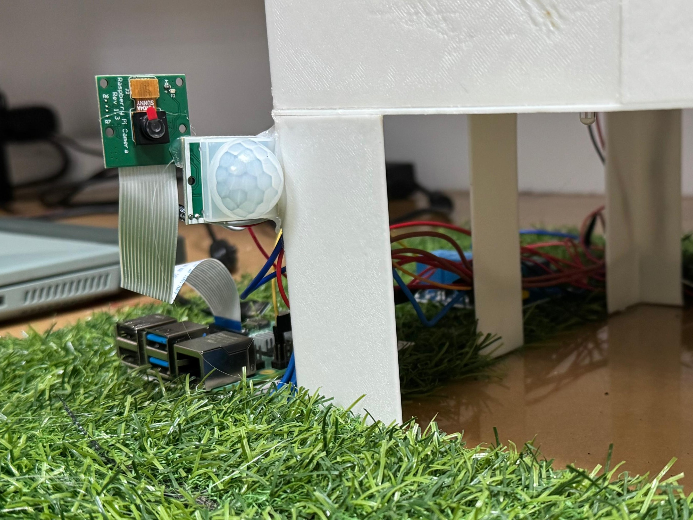

# 🏠 SmartNest: Smart Home Automation and Security System

SmartNest is a Raspberry Pi-based smart home system that automates environmental monitoring and security features. It uses sensors (motion, temperature, humidity, gas, RFID, flow) and actuators (fan, LEDs, servo motors) with MQTT-based control and email alerts.

---

## 🚀 Features

* 📷 Motion-triggered image capture using Picamera2
* ✉️ Email alerts with attached images via Yagmail
* 🌡️ Temperature & humidity monitoring (DHT)
* 🌫️ Gas sensor-based air quality detection
* 🚰 Flow rate monitoring (YF-S201)
* 📢 MQTT integration with ThingsBoard
* 🔑 RFID tag-based access control
* 🌬️ Auto/manual control of fan and window
* 📊 Telemetry and real-time control via ThingsBoard RPC

---

## 🔧 Hardware Requirements

* Raspberry Pi 4 or newer
* **DHT11/DHT22** sensor
* **MQ-135** gas sensor
* **PIR motion sensors x2**
* **RC522 RFID** module
* **MG90S Servo** (window/door control)
* **YF-S201** water flow sensor
* **5V relay module** (fan control)
* **LEDs** for status/alerts
* **Camera Module (v1.3/v2/v3)** with Picamera2 support

---

## 📁 Project Structure

```
SmartNest/
├── main.py                   
├── config.py                  
├── mqtt_client.py            
├── camera.py                
├── sensors/
│   ├── dht.py
│   ├── gas.py
│   ├── flow.py
│   ├── pir.py
│   └── rfid.py
├── actuators/
│   ├── led.py
│   ├── fan.py
│   └── servo.py
├── requirements.txt
└── README.md
```

---

## 🎓 Software Setup

### 1. Clone the repository

```bash
git clone https://github.com/aadilnaji/SmartNest.git
cd SmartNest
```

### 2. Create virtual environment

```bash
python3 -m venv venv
source venv/bin/activate
```

### 3. Install dependencies

```bash
pip install -r requirements.txt
```

### 4. Enable Raspberry Pi Interfaces

* Camera
* I2C
* SPI
  Use `raspi-config` if needed.

### 5. Create `.env` file

```
EMAIL_USER=your_email@gmail.com
EMAIL_PASS=your_app_password
EMAIL_TO=recipient_email@gmail.com
THINGSBOARD_TOKEN=your_device_token

```

---

## 🛠️ Running the System

```bash
python main.py
```

This starts:

* All sensor threads
* Motion worker (image + email)
* MQTT connection
* Main loop with automatic fan/window logic

---

## 📈 MQTT Integration (ThingsBoard)

### Telemetry Topic:

```
v1/devices/me/telemetry
```

### RPC Request Topic:

```
v1/devices/me/rpc/request/+
```

### RPC Methods Supported:

| Method     | Action                 |
| ---------- | ---------------------- |
| setLight   | Toggle LED1            |
| setLight2  | Toggle LED2            |
| setLight3  | Toggle LED3            |
| setLight4  | Toggle LED4            |
| setFan     | Manual fan on/off/null |
| openDoor   | Trigger door servo     |
| openWindow | Trigger window servo   |

---

## 🔗 Dependencies

From `requirements.txt`:

```
gpiozero
python-dotenv
Rpi.GPIO
lgpio
adafruit-circuitpython-dht
mfrc522
paho-mqtt
yagmail
picamera2 # If not installed already, use sudo apt install -y python3-picamera2
```

---

## 📷 Screenshots


<p align="center">
  
  
</p>


---

## 📄 License

MIT License. Feel free to fork, use, and improve.

---

## 🙌 Contributing

PRs, bug reports, and feature suggestions are welcome!

```bash
# Fork the repo, make changes, and create a pull request
```

---

## 📢 Contact

For questions or feedback, contact: **[adiltm43@gmail.com](mailto:adiltm43@gmail.com)**
